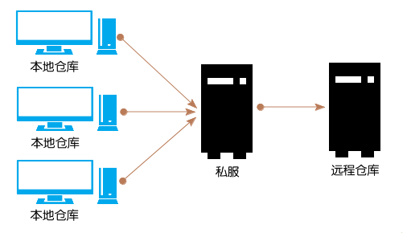
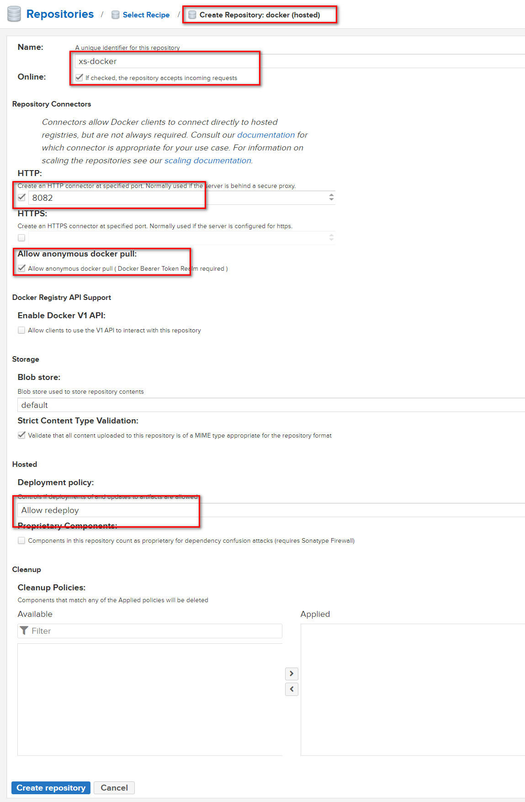

### [Nexus](https://help.sonatype.com/repomanager3/)


---

#### [Installation](https://help.sonatype.com/repomanager3/installation)
```
# nexus运行在Java中
# 先安装Java环境

# 下载解压到/usr/local/nexus
# 解压完成生成nexus-{version}、sonatype-work两个目录

# 创建用户
groupadd -r nexus
useradd -r -g nexus -s/bin/bash -d /home/nexus -M nexus

# 修改目录权限
chown -R nexus:nexus /usr/local/nexus

# linux文件句柄为4096而nexus需要配置为65536
vi /etc/security/limits.conf
> nexus - nofile 65536

#  修改配置项
cd /usr/local/nexus-{version}
# Java Home
vi nexus-{version}/bin/nexus
> INSTALL4J_JAVA_HOME_OVERRIDE=/usr/local/jdk1.8.0_281

# 运行用户
vi ./nexus-{version}/bin/nexus.rc
>  run_as_user="nexus"

# 端口号
vi nexus-{version}/etc/nexus-default.properties

# 打开防火墙
firewall-cmd --permanent --add-port=8081/tcp
firewall-cmd --reload

# JVM配置：这里没配置
vi nexus-{version}/etc/nexus.vmoptions
```

#### COMMAND
```
# start, stop, restart, force-reload and status
cd /usr/local/nexus
./nexus-{version}/nexus run
# or
nohup sh /usr/local/nexus/nexus-{version}/bin/nexus run &

# 后台运行
/usr/local/nexus/nexus-{version}/bin/nexus start
```

#### 注册为Linux服务
```
cd /usr/local/nexus
vi ./nexus-{version}/bin/nexus.rc
>  run_as_user="nexus"
# 建立软链接
sudo ln -s /usr/local/nexus/nexus-{version}/bin/nexus /etc/init.d/nexus
cd /etc/init.d
sudo chkconfig --add nexus
sudo chkconfig --levels 345 nexus on

# 使用系统服务命令
sudo service nexus start|stop|restart|status
```

#### 仓库类型
- hosted：本地代理仓库，通常我们会部署自己的构件到这一类型的仓库，可以push和pull
- proxy：代理的远程仓库，它们被用来代理远程的公共仓库，如maven中央仓库，只能pull
- group：仓库组，用来合并多个hosted/proxy仓库，通常我们配置maven依赖仓库组，只能pull

#### docker私有仓库

```
# nexus管理界面，create repositories -> docker(hosted)
# 开启nexus-docker端口防火墙
firewall-cmd --permanent --add-port=8082/tcp
firewall-cmd --reload

# docker服务器
vi /etc/docker/daemon.json
> {"insecure-registries": ["10.0.0.102:8082"]}
# 重启docker
systemctl restart docker

# 测试
docker pull nginx:stable
docker tag nginx:stable 10.0.0.102:8082/library/nginx:1.18
docker login -u admin -p admin http://10.0.0.102:8082
docker push 10.0.0.102:8082/library/nginx:1.18

# 基础镜像
docker pull nginx:1.19.8
docker pull nginx:1.18.0
docker pull php:8.0.3-fpm
docker pull php:7.4.16-fpm
docker pull php:5.6-fpm
docker pull python:3.9.2
docker pull python:3.8.8
docker pull python:3.7.10
docker pull python:3.6.13
docker pull python:3.5.10

docker tag nginx:1.19.8 10.0.0.119:8082/library/nginx:1.19.8
docker tag nginx:1.18.0 10.0.0.119:8082/library/nginx:1.18.0
docker tag php:8.0.3-fpm 10.0.0.119:8082/library/php:8.0.3-fpm
docker tag php:7.4.16-fpm 10.0.0.119:8082/library/php:7.4.16-fpm
docker tag php:5.6-fpm 10.0.0.119:8082/library/php:5.6-fpm
docker tag python:3.9.2 10.0.0.119:8082/library/python:3.9.2
docker tag python:3.8.8 10.0.0.119:8082/library/python:3.8.8
docker tag python:3.7.10 10.0.0.119:8082/library/python:3.7.10
docker tag python:3.6.13 10.0.0.119:8082/library/python:3.6.13
docker tag python:3.5.10 10.0.0.119:8082/library/python:3.5.10

docker login -u admin -p 10.0.0.119:8082

docker push 10.0.0.119:8082/library/nginx:1.19.8
docker push 10.0.0.119:8082/library/nginx:1.18.0
docker push 10.0.0.119:8082/library/php:8.0.3-fpm
docker push 10.0.0.119:8082/library/php:7.4.16-fpm
docker push 10.0.0.119:8082/library/php:5.6-fpm
docker push 10.0.0.119:8082/library/python:3.9.2
docker push 10.0.0.119:8082/library/python:3.8.8
docker push 10.0.0.119:8082/library/python:3.7.10
docker push 10.0.0.119:8082/library/python:3.6.13
docker push 10.0.0.119:8082/library/python:3.5.10
```

#### maven私有仓库
