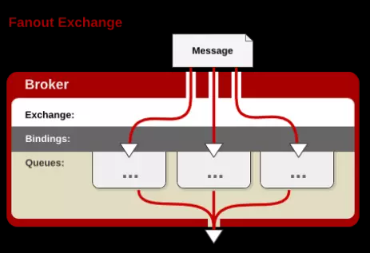

### RabbitMQ

---

#### 概念模型
- Broker: 接收和分发消息的应用，RabbitMQ Server就是Message Broker。
- Virtual host: 出于多租户和安全因素设计的，把AMQP的基本组件划分到一个虚拟的分组中，类似于网络中的namespace概念。当多个不同的用户使用同一个RabbitMQ server提供的服务时，可以划分出多个vhost，每个用户在自己的vhost创建exchange／queue等。
- Connection: publisher／consumer和broker之间的TCP连接。断开连接的操作只会在client端进行，Broker不会断开连接，除非出现网络故障或broker服务出现问题。
- Channel: 如果每一次访问RabbitMQ都建立一个Connection，在消息量大的时候建立TCP Connection的开销将是巨大的，效率也较低。Channel是在connection内部建立的逻辑连接，如果应用程序支持多线程，通常每个thread创建单独的channel进行通讯，AMQP method包含了channel id帮助客户端和message broker识别channel，所以channel之间是完全隔离的。Channel作为轻量级的Connection极大减少了操作系统建立TCP connection的开销。
- Exchange: message到达broker的第一站，根据分发规则，匹配查询表中的routing key，分发消息到queue中去。常用的类型有：direct (point-to-point), topic (publish-subscribe) and fanout (multicast)。
- Queue: 消息最终被送到这里等待consumer取走。一个message可以被同时拷贝到多个queue中。
- Binding: exchange和queue之间的虚拟连接，binding中可以包含routing key。Binding信息被保存到exchange中的查询表中，用于message的分发依据。

#### “生产／消费”消息模型
生产者发送消息到broker server（RabbitMQ）。在Broker内部，用户创建Exchange／Queue，通过Binding规则将两者联系在一起。Exchange分发消息，根据类型／binding的不同分发策略有区别。消息最后来到Queue中，等待消费者取走。

#### Exchange类型
Exchange有多种类型，最常用的是Direct／Fanout／Topic三种类型。

- Direct
Message中的“routing key”如果和Binding中的“binding key”一致， Direct exchange则将message发到对应的queue中。

- Fanout
每个发到Fanout类型Exchange的message都会分到所有绑定的queue上去。

- Topic
根据routing key，及通配规则，Topic exchange将分发到目标queue中。

