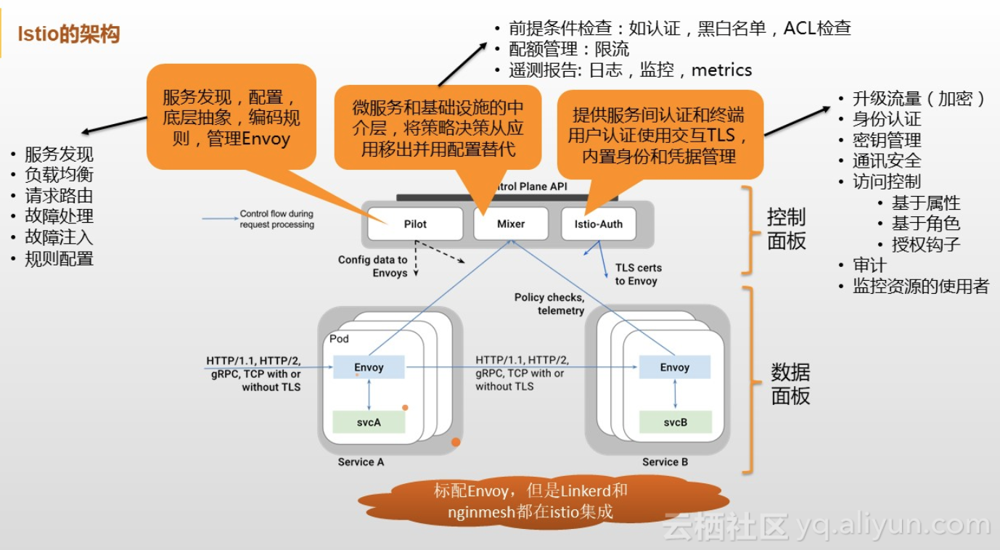

### Mesh

---

#### Istio
用来连接、管理和保护微服务的开放平台

* 定义
    + 用来连接、管理和保护微服务的开放平台
    + 提供一种简单的方式来建立已部署服务网络，具备负载均衡、服务间认证、监控等功能，而不需要改动任何服务代码
    
* 主要功能
    + 流量管理(Pilot)：控制服务之间的流量和API调用的流向，使得调用更灵活可靠，并使网络在恶劣情况下更加健壮
    + 可观察性：通过集成zipkin等服务，快速了解服务之间的依赖关系，以及它们之间流量的本质和流向，从而提供快速识别问题的能力
    + 策略执行(mixer)：将组织策略应用于服务之间的互动，确保访问策略得以执行，资源在消费者之间良好分配。策略的更改是通过配置网格而不是修改应用程序代码
    + 服务身份和安全(Istio-auth)：为网格中的服务提供可验证身份，并提供保护服务流量的能力，使其可以在不同可信度的网络上流转

* 架构
    + 控制平面(Control Plane)：Pilot, Mixer, Istio-Auth，分别对Istio中的服务做流量管理，策略配置，安全通信等规则配置 
    + 数据平面(Data Plane)：处理网格内服务之间的通信，并负责实现服务发现、负载平衡、流量管理、健康检查等功能

####  Sidecar
在环境中部署一个sidecar，使用Istio控制面板功能配置和管理代理，拦截微服务之间的所有网络通信

* Sidecar解决的问题
    + 隔离（separation of concerns）：让每个容器都能够关注核心问题；例如：web-server只专注web服务，而日志收集等交给sidecar去处理
    + 单一责任原则（single responsibility principle）：容器发生变化需要一个明确的理由
    + 内聚性/可重用性（Cohesiveness/Reusability）：使用sidecar容器处理日志，这个容器按道理应该可以应用的其他地方重用

#### [Envoy](https://yq.aliyun.com/articles/606655?utm_content=m_1000005021)

* 微服务治理层分析
    + 以SDK的方式侵入业务代码中，如Dubbo
    + 以进程外方式(sidercar)代理，如Istio
        - 需要解决服务间通信功能，或者说是服务与代理以及代理与代理间的通信
        - 服务间通信时，必须知道对方IP和Port，从服务注册中心获取。注册与发现的设计，一是每次都调用第三方接口，获取当前有效IP和Port；另外一种方式即在本地缓存第三方的配置，当变更时，实时同步，如目前比较成熟的组件ZooKeeper
        - 在解决了核心的服务间通信以及服务注册与发现后，如负载均衡、限流、熔断和监控等功能

#### SDN
软件定义网络(Software Defined Network, SDN)

